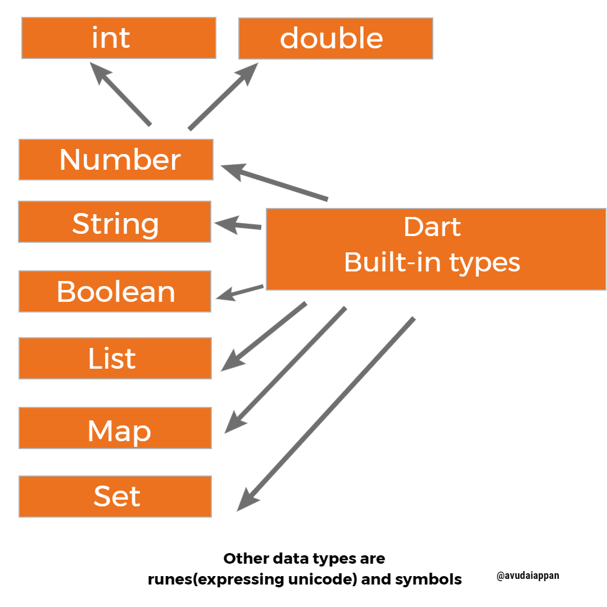

# flutter-dart-basics
This is a repository of *30 Day Of Coding Challenge* started on March 14, 2020.  All the day workings are uploaded here for future uses.
//This is a single line comment
/*
 * This is a multi-line comment
 * This does not executed when running!
*/

<h2>Flutter is Google’s UI toolkit for building beautiful, natively compiled applications for mobile, web, and desktop from a single codebase.</h2>

<h2>30 Day Challenge </h2>

 Follow For More Challenge 

<h2>Dart Built-in types </h2>

